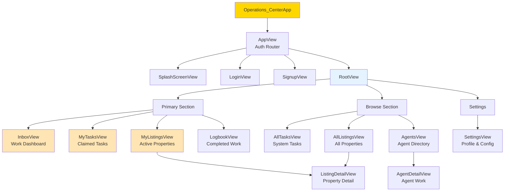
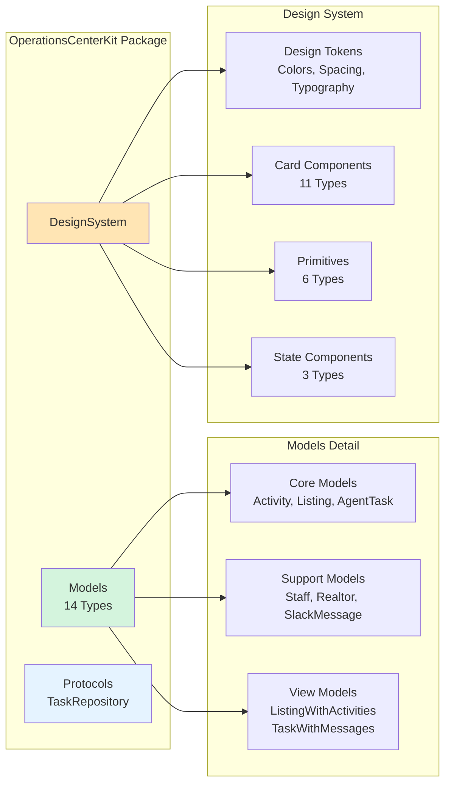
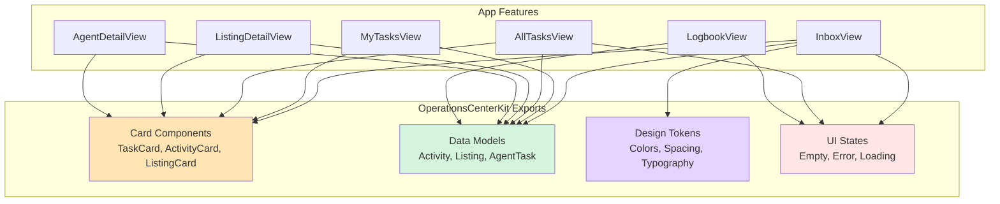
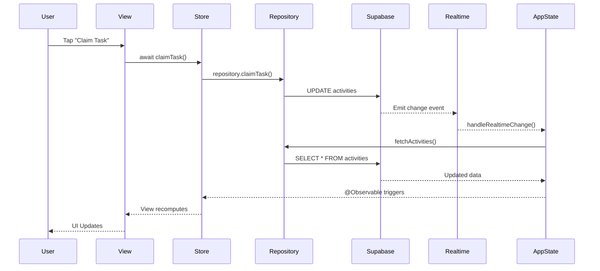
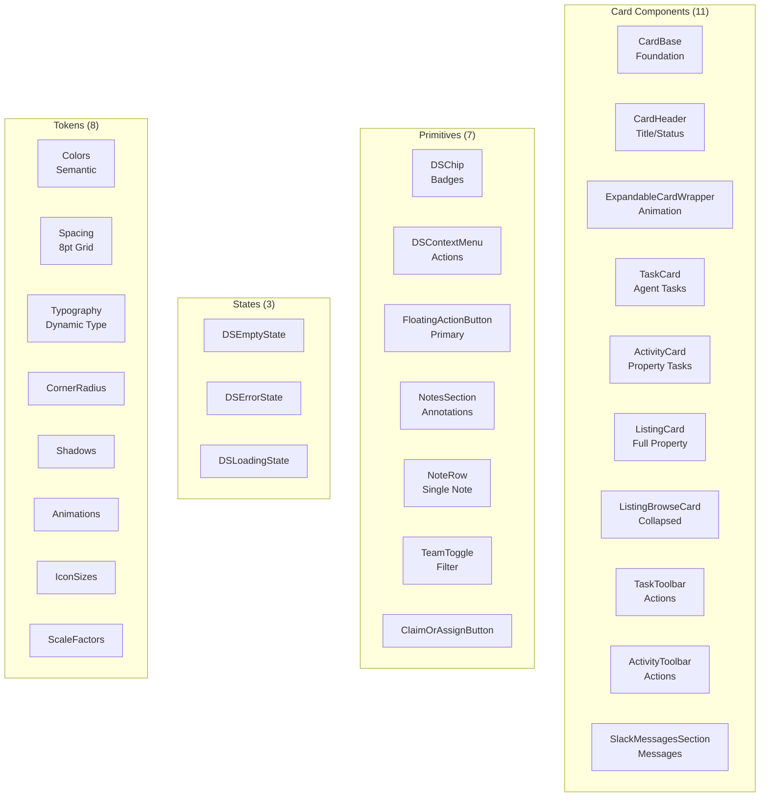
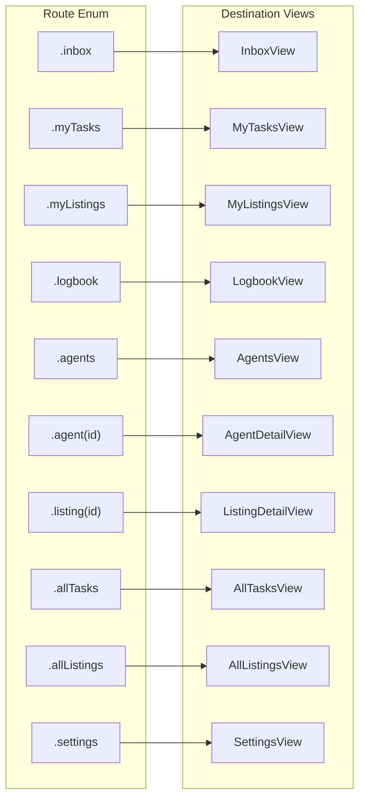
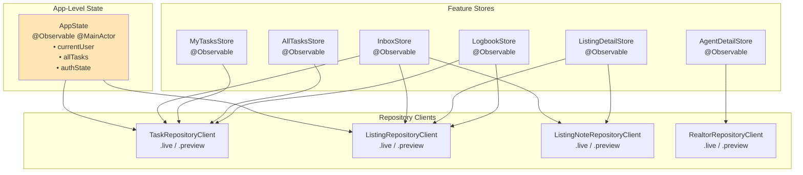
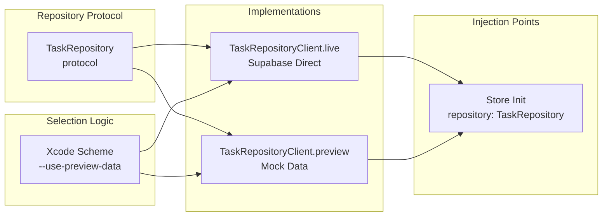

# Operations Center Visual Architecture Map

## Executive Summary

**Operations Center** is a multi-platform SwiftUI app (iOS + macOS + iPadOS) for real estate operations management. The architecture follows a clean MVVM pattern with a centralized design system package.

**Key Numbers:**
- 104 Swift files total
- 18 primary screens
- 49 reusable components
- 14 data models
- 0 external dependencies in design system

---

## System Architecture Overview

```mermaid
graph TB
    subgraph "Client Applications"
        iOS[iOS App]
        macOS[macOS App]
        iPad[iPadOS App]
    end

    subgraph "Swift Architecture"
        App[Operations_CenterApp<br/>@main Entry Point]
        Auth[Authentication Flow<br/>Login/Signup/Session]
        Nav[NavigationStack<br/>Route-based]
        Features[18 Feature Screens<br/>MVVM Pattern]
        State[AppState<br/>@Observable]
    end

    subgraph "Shared Package"
        Kit[OperationsCenterKit<br/>49 Components + 14 Models]
    end

    subgraph "Data Layer"
        Repos[Repository Clients<br/>DI Pattern]
        Supa[Supabase SDK<br/>Direct CRUD]
        RT[Realtime<br/>Subscriptions]
    end

    subgraph "External Services"
        SupaDB[(Supabase<br/>PostgreSQL)]
        FastAPI[FastAPI<br/>Intelligence Only]
    end

    iOS --> App
    macOS --> App
    iPad --> App

    App --> Auth
    Auth --> Nav
    Nav --> Features
    Features --> State
    Features --> Kit
    State --> Repos
    Repos --> Supa
    Supa --> SupaDB
    Supa --> RT
    RT --> State

    Features -.-> FastAPI

    style Kit fill:#FFE5B4
    style State fill:#E5F3FF
    style SupaDB fill:#D4F4DD
```

---

## Component Hierarchy Tree



---

## OperationsCenterKit Module Map



### OperationsCenterKit Dependency Flow



---

## Data Flow Architecture



---

## View & Component Inventory

### Primary Screens (18 Total)

| Screen | Purpose | Components Used | Navigation |
|--------|---------|-----------------|------------|
| **SplashScreenView** | Loading during auth | ProgressView | Auto-transition |
| **LoginView** | Email/password signin | Form, TextField | → RootView |
| **SignupView** | Create account | TeamSelectionCard | → RootView |
| **AppView** | Auth routing | ZStack | Root controller |
| **RootView** | Main navigation | NavigationStack | Hub for all screens |
| **InboxView** | Work dashboard | ListingCard, TaskCard | Route.inbox |
| **MyTasksView** | Claimed tasks | TaskCard, DSContextMenu | Route.myTasks |
| **MyListingsView** | User's properties | ListingBrowseCard | Route.myListings |
| **AllTasksView** | Browse all tasks | TaskCard, ActivityCard | Route.allTasks |
| **AllListingsView** | Browse properties | ListingCollapsedContent | Route.allListings |
| **ListingDetailView** | Property detail | ActivityCard, NotesSection | Route.listing(id) |
| **AgentDetailView** | Agent's work | ListingBrowseCard, TaskCard | Route.agent(id) |
| **AgentsView** | Agent directory | RealtorRow | Route.agents |
| **LogbookView** | Completed work | ListingBrowseCard | Route.logbook |
| **TeamView** | Team work (generic) | TaskCard, ActivityCard | Reusable |
| **AdminTeamView** | Admin tasks | TeamView wrapper | Via TeamView |
| **MarketingTeamView** | Marketing tasks | TeamView wrapper | Via TeamView |
| **SettingsView** | User settings | List, TeamPicker | Route.settings |

### Component Library (49 Components)



---

## Navigation Architecture



---

## State Management Architecture



---

## Dependency Injection Pattern



---

## Kit Component Usage Heat Map

| Component | Usage Count | Used By |
|-----------|------------|---------|
| **TaskCard** | 6 | InboxView, MyTasksView, AllTasksView, AgentDetailView, TeamView × 2 |
| **ActivityCard** | 5 | ListingDetailView, AllTasksView, AgentDetailView, TeamView × 2 |
| **ListingCard** | 1 | InboxView |
| **ListingBrowseCard** | 4 | MyListingsView, AgentDetailView, LogbookView |
| **DSContextMenu** | 8 | Most expandable card views |
| **FloatingActionButton** | 3 | MyTasksView, AllTasksView, InboxView |
| **DSEmptyState** | 10+ | All list views |
| **DSErrorState** | 8+ | All views with error handling |
| **SkeletonCard** | 2 | AllTasksView, AllListingsView |
| **NotesSection** | 1 | ListingDetailView |
| **TeamToggle** | 1 | AllTasksView |
| **Colors** | All | Every view references semantic colors |
| **Spacing** | All | Every view uses spacing tokens |

---

## File Structure Map

```
Operations Center/
├── 📱 Main App (47 files)
│   ├── App/
│   │   └── Config.swift
│   ├── Features/ (18 screens)
│   │   ├── Auth/ (4 files)
│   │   ├── MyTasks/ (2 files)
│   │   ├── MyListings/ (2 files)
│   │   ├── AllTasks/ (2 files)
│   │   ├── AllListings/ (2 files)
│   │   ├── ListingDetail/ (2 files)
│   │   ├── Agents/ (4 files)
│   │   ├── Logbook/ (2 files)
│   │   ├── AdminTeam/ (2 files)
│   │   ├── MarketingTeam/ (2 files)
│   │   ├── TeamView/ (2 files)
│   │   └── Inbox/ (1 file)
│   ├── Dependencies/ (4 clients)
│   ├── Navigation/
│   │   └── Route.swift
│   ├── State/
│   │   └── AppState.swift
│   └── Core Files
│       ├── Operations_CenterApp.swift (@main)
│       ├── ContentView.swift
│       ├── RootView.swift
│       └── Supabase.swift
│
├── 📦 OperationsCenterKit/ (49 files)
│   ├── Models/ (14 files)
│   ├── Protocols/ (1 file)
│   └── DesignSystem/
│       ├── Components/ (24 files)
│       │   ├── Cards/ (11)
│       │   ├── Primitives/ (7)
│       │   ├── States/ (3)
│       │   └── Others/ (3)
│       ├── Tokens/ (8 files)
│       ├── Extensions/ (1 file)
│       └── Haptics/ (1 file)
│
└── 🧪 Tests/ (8 files)
    ├── Unit Tests/ (6)
    └── UI Tests/ (2)
```

---

## Critical Architectural Decisions

### 1. Direct Supabase Access (No Backend for CRUD)
```
Swift App → Supabase PostgREST → PostgreSQL
         ↘ Supabase Realtime ↗
```
FastAPI reserved ONLY for AI intelligence operations.

### 2. @Observable over ObservableObject
Swift 6 pattern with automatic MainActor enforcement.

### 3. Repository Client Pattern for DI
Struct of closures enables seamless .live/.preview swapping.

### 4. Things 3 Navigation Pattern
Primary actions at top, browse sections below, settings at bottom.

### 5. OperationsCenterKit as Presentation Layer
Not a utility library—it IS the view layer extracted.

### 6. Real-time First Architecture
All changes propagate instantly via Supabase subscriptions.

---

## Architecture Health Metrics

| Metric | Value | Status |
|--------|-------|--------|
| **Total Files** | 104 Swift | ✅ Manageable |
| **Max File Size** | 390 lines (ListingCard) | ✅ Reasonable |
| **Feature Isolation** | 100% MVVM | ✅ Excellent |
| **Code Reuse** | 49 shared components | ✅ High |
| **External Dependencies** | 0 in Kit, 1 in App (Supabase) | ✅ Minimal |
| **Test Coverage** | Unit + UI tests present | ⚠️ Needs expansion |
| **Navigation Complexity** | Single enum, 10 routes | ✅ Simple |
| **State Management** | Single AppState + feature stores | ✅ Clear |
| **Hardcoded Values** | 0 in design system | ✅ Token-based |
| **Platform Support** | iOS + macOS + iPadOS | ✅ Universal |

---

## Summary

Operations Center demonstrates **ruthless simplicity** in action:

- **One pattern** (MVVM with @Observable)
- **One package** (OperationsCenterKit for all UI)
- **One state source** (AppState with real-time sync)
- **One navigation model** (Route enum)
- **Zero complexity** where it isn't needed

The architecture is optimized for:
1. **Instant responsiveness** via real-time subscriptions
2. **Maximum reuse** via the Kit package
3. **Testing isolation** via repository pattern
4. **Developer clarity** via consistent patterns

Every decision reduces cognitive load. Every component has one job. Every file has a clear purpose.

**This is how you build an app that vanishes from consciousness while users get their work done.**

---

*Generated Architecture Map - Operations Center iOS*
*Last Updated: November 2024*