# Operations Center: Complete Visual Architecture

**Last Updated:** 2025-11-18
**Platform:** Multi-platform SwiftUI (iOS 18.5+, macOS 14+)
**Architecture:** MVVM + Repository Pattern + Design System

---

## Table of Contents
1. [System Architecture Overview](#system-architecture-overview)
2. [Navigation Flow](#navigation-flow)
3. [Data Flow Architecture](#data-flow-architecture)
4. [Feature Map](#feature-map)
5. [Component Hierarchy](#component-hierarchy)
6. [State Management](#state-management)
7. [Design System](#design-system)
8. [Models & Data Structures](#models--data-structures)
9. [Services & Dependencies](#services--dependencies)
10. [View Catalog](#view-catalog)

---

## System Architecture Overview


### Architecture Philosophy

**FastAPI = Intelligence Only**
- No CRUD endpoints
- AI agents, classification, chat
- LangChain/LangGraph orchestration

**Swift = Direct Supabase**
- All CRUD goes Swift → Supabase
- Realtime subscriptions for live updates
- No unnecessary API layers

---

## Navigation Flow


### Route Enum

```swift
enum Route: Hashable, Identifiable {
    case inbox                  // Inbox icon
    case myTasks               // Person icon
    case myListings            // House icon
    case logbook               // Book icon
    case allTasks              // Checkmark icon
    case allListings           // Building icon
    case agents                // People icon
    case agent(id: String)     // Individual agent
    case listing(id: String)   // Individual listing
    case settings              // Gear icon
}
```

---

## Data Flow Architecture


### Key Principles

1. **Single Source of Truth**: Supabase database
2. **Direct Access**: No API layer for CRUD
3. **Realtime Sync**: Permanent subscription keeps all views fresh
4. **Local State**: Stores cache data for performance
5. **Optimistic Updates**: UI updates immediately, reconciles on confirmation

---

## Feature Map

```
┌─────────────────────────────────────────────────────────────────┐
│                         RootView                                │
│                   (NavigationStack)                             │
├─────────────────┬───────────────────────────────────────────────┤
│   Sidebar       │              Main Content Area                │
│                 │                                               │
│ ┌─────────────┐ │                                               │
│ │ INBOX       │─┼─> InboxView                                  │
│ │             │ │    • Unclaimed agent tasks                    │
│ │ MY TASKS    │ │    • Unacknowledged listing activities        │
│ │             │─┼─> MyTasksView                                │
│ │ MY LISTINGS │ │    • User's claimed tasks                     │
│ │             │─┼─> MyListingsView                             │
│ │ LOGBOOK     │ │    • User's acknowledged listings             │
│ │             │─┼─> LogbookView                                │
│ │ ─────────   │ │    • Completed listings                       │
│ │ ALL TASKS   │ │    • Completed tasks                          │
│ │             │─┼─> AllTasksView                               │
│ │ ALL LISTINGS│ │    • All claimed tasks (team-wide)            │
│ │             │─┼─> AllListingsView                            │
│ │ AGENTS      │ │    • All listings (team-wide)                 │
│ │             │─┼─> AgentsView → AgentDetailView              │
│ │ SETTINGS    │ │    • All agents → Individual agent work       │
│ │             │─┼─> SettingsView                               │
│ └─────────────┘ │    • User settings, logout                    │
│                 │                                               │
└─────────────────┴───────────────────────────────────────────────┘
```

### Feature-by-Feature Breakdown

| Feature | Store | Purpose | Key Actions |
|---------|-------|---------|-------------|
| **Inbox** | `InboxStore` | Unclaimed work intake | Claim, Delete, Acknowledge |
| **My Tasks** | `MyTasksStore` | Personal task management | Expand, Claim, Delete |
| **My Listings** | `MyListingsStore` | Personal listings | Filter, Navigate |
| **Logbook** | `LogbookStore` | Archive of completed work | View history |
| **All Tasks** | `AllTasksStore` | Team task overview | Filter by team, Claim, Delete |
| **All Listings** | `AllListingsStore` | Team listings overview | Filter by category |
| **Agents** | `AgentsStore` | Team member directory | Navigate to agent detail |
| **Agent Detail** | `AgentDetailStore` | Individual agent's work | Claim tasks, Delete |
| **Listing Detail** | `ListingDetailStore` | Listing activities + notes | Add notes, Claim activities |
| **Settings** | N/A | App settings | Team switch, Logout |

---

## Component Hierarchy

### View Component Tree

```
AppView (@main entry)
├─ SplashScreenView (session restore)
├─ LoginView
│  └─ SignupView (sheet)
└─ RootView (authenticated)
   ├─ NavigationStack
   │  ├─ Sidebar (List)
   │  │  └─ NavigationLink × 8
   │  └─ navigationDestination
   │     ├─ InboxView
   │     │  ├─ TaskCard × N (expandable)
   │     │  ├─ ListingCard × N (expandable)
   │     │  └─ FloatingActionButton
   │     ├─ MyTasksView
   │     │  ├─ TaskCard × N (expandable)
   │     │  ├─ DSContextMenu
   │     │  └─ FloatingActionButton
   │     ├─ MyListingsView
   │     │  ├─ CategoryFilterPicker
   │     │  └─ ListingBrowseCard × N
   │     │     └─ NavigationLink → ListingDetailView
   │     ├─ AllTasksView
   │     │  ├─ TeamToggle
   │     │  ├─ TaskCard × N (expandable)
   │     │  ├─ ActivityCard × N (expandable)
   │     │  └─ FloatingActionButton
   │     ├─ AllListingsView
   │     │  ├─ CategoryFilterPicker
   │     │  └─ ListingBrowseCard × N
   │     │     └─ NavigationLink → ListingDetailView
   │     ├─ LogbookView
   │     │  └─ ListingBrowseCard × N
   │     │     └─ NavigationLink → ListingDetailView
   │     ├─ AgentsView
   │     │  └─ RealtorRow × N
   │     │     └─ NavigationLink → AgentDetailView
   │     ├─ AgentDetailView
   │     │  ├─ ListingBrowseCard × N
   │     │  ├─ TaskCard × N (expandable)
   │     │  └─ ActivityCard × N (expandable)
   │     ├─ ListingDetailView
   │     │  ├─ NotesSection
   │     │  │  └─ NoteRow × N
   │     │  ├─ ActivityCard × N (Marketing)
   │     │  ├─ ActivityCard × N (Admin)
   │     │  └─ ActivityCard × N (Other)
   │     └─ SettingsView
   │        └─ Team Picker
   └─ @Environment(AppState)
```

### Card Component Family

```
CardBase (foundation)
└─ tintColor: Color
└─ onTap: () -> Void

ExpandableCardWrapper (behavior)
├─ isExpanded: Bool
├─ collapsed: Content
└─ expanded: Content

TaskCard (orange accent - general tasks)
├─ ExpandableCardWrapper
│  ├─ Collapsed
│  │  └─ CardHeader (title, chips, chevron)
│  └─ Expanded
│     ├─ SlackMessagesSection (thread display)
│     ├─ MetadataGrid (assignee, due date, etc.)
│     └─ TaskToolbar (Claim, Assign, Delete)

ActivityCard (blue accent - listing tasks)
├─ ExpandableCardWrapper
│  ├─ Collapsed
│  │  └─ CardHeader (title, chips, chevron)
│  └─ Expanded
│     ├─ Property context (listing address)
│     ├─ MetadataGrid (assignee, due date, etc.)
│     └─ ActivityToolbar (Claim, Assign, Delete)

ListingCard (full detail)
├─ CardBase
│  ├─ CardHeader (address, realtor, status)
│  ├─ NotesSection (inline notes)
│  └─ Activity rows (tap to expand)

ListingBrowseCard (collapsed only)
└─ ListingCollapsedContent
   └─ CardHeader (address, realtor, chips)
```

---

## State Management

### Store Architecture


### State Patterns

**@Observable Pattern (Swift 6)**
```swift
@Observable @MainActor
final class MyTasksStore {
    var tasks: [AgentTask] = []
    var expandedTaskId: String?
    var isLoading = false
    var errorMessage: String?

    @ObservationIgnored @Dependency(\.authClient) var authClient
    @ObservationIgnored @Dependency(\.taskRepository) var taskRepo

    func fetchMyTasks() async {
        isLoading = true
        defer { isLoading = false }

        do {
            let userId = try await authClient.currentUserId()
            tasks = try await taskRepo.fetchTasksByStaff(staffId: userId)
        } catch {
            errorMessage = error.localizedDescription
        }
    }
}
```

**View Integration**
```swift
struct MyTasksView: View {
    @State private var store: MyTasksStore

    var body: some View {
        List {
            ForEach(store.tasks) { task in
                TaskCard(
                    task: task,
                    isExpanded: store.expandedTaskId == task.id,
                    onTap: { store.toggleExpansion(task.id) }
                )
            }
        }
        .task { await store.fetchMyTasks() }
    }
}
```

### Global State: AppState

```swift
@Observable @MainActor
final class AppState {
    var allTasks: [Activity] = []
    var currentUser: Supabase.User?
    var isLoading = false
    var errorMessage: String?

    private var realtimeChannel: RealtimeChannelV2?

    var inboxTasks: [Activity] {
        allTasks.filter { $0.assignedStaffId == nil }
    }

    var myTasks: [Activity] {
        allTasks.filter { $0.assignedStaffId == currentUser?.id.uuidString }
    }

    func setupPermanentRealtimeSync() async {
        let channel = supabase.realtimeV2.channel("all_tasks")

        for await change in channel.postgresChange(AnyAction.self, table: "activities") {
            switch change {
            case .insert(let record):
                // Add new task
            case .update(let record):
                // Update existing
            case .delete(let record):
                // Remove deleted
            }
        }
    }
}
```

---

## Design System

### Color Palette

```
Brand Colors
├─ Primary (Blue)      #007AFF
├─ Secondary (Purple)  #5856D6
└─ Accent (Orange)     #FF9500

Semantic Colors
├─ Success             #34C759
├─ Warning             #FF9500
├─ Error               #FF3B30
└─ Info                #007AFF

Surface Colors
├─ Background          System Background
├─ Secondary BG        System Secondary BG
├─ Tertiary BG         System Tertiary BG
└─ Card Background     System Grouped BG

Task Category Colors
├─ Marketing           #4299E1 (Blue)
├─ Admin               #F56565 (Red)
├─ Photo               #48BB78 (Green)
├─ Staging             #ED8936 (Orange)
└─ Inspection          #9F7AEA (Purple)

Listing Status Colors
├─ Active              #48BB78 (Green)
├─ Pending             #ECC94B (Yellow)
└─ Completed           #9F7AEA (Purple)
```

### Typography Scale

```
Display Hierarchy
├─ Large Title         34pt  Bold       (Navigation titles)
├─ Title 1             28pt  Bold       (Section headers)
├─ Title 2             22pt  Bold       (Card titles)
├─ Title 3             20pt  Semibold   (Subsection headers)
├─ Headline            17pt  Semibold   (Card headers)
├─ Body                17pt  Regular    (Body text)
├─ Callout             16pt  Regular    (Secondary text)
├─ Subheadline         15pt  Regular    (Metadata)
├─ Footnote            13pt  Regular    (Captions)
├─ Caption 1           12pt  Regular    (Small labels)
└─ Caption 2           11pt  Medium     (Chips, badges)

* All sizes support Dynamic Type
* All use San Francisco (system font)
```

### Spacing System (8pt Grid)

```
Spacing.xs     4pt   (Tight spacing)
Spacing.sm     8pt   (Default spacing)
Spacing.md    12pt   (Section spacing)
Spacing.lg    16pt   (Component spacing)
Spacing.xl    24pt   (Large gaps)
Spacing.xxl   32pt   (Screen padding)
```

### Component Tokens

**Corner Radius**
```
CornerRadius.sm     4pt   (Chips)
CornerRadius.md     8pt   (Buttons)
CornerRadius.lg    12pt   (Cards)
CornerRadius.xl    16pt   (Modals)
```

**Shadows**
```
Shadows.sm    2pt blur   (Subtle elevation)
Shadows.md    8pt blur   (Card elevation)
Shadows.lg   16pt blur   (Modal elevation)
```

**Animation Curves**
```
Animations.standard        spring(response: 0.3, dampingFraction: 0.68)
Animations.cardExpansion   spring(response: 0.3, dampingFraction: 0.68)
Animations.buttonPress     spring(response: 0.25, dampingFraction: 0.7)
Animations.quickSnap       spring(response: 0.2, dampingFraction: 0.8)
```

### Design System Components

```
Primitives
├─ DSChip              Colored badge (category, status)
├─ DSContextMenu       Bottom floating action menu
├─ FloatingActionButton  Primary action button
├─ TeamToggle          3-state segmented control
├─ NotesSection        Notes list + inline add
├─ NoteRow             Single note display
└─ MetadataItem        Label-value pair

Cards
├─ CardBase            Base card container
├─ ExpandableCardWrapper  Collapse/expand behavior
├─ TaskCard            Orange accent (general tasks)
├─ ActivityCard        Blue accent (listing tasks)
├─ ListingCard         Full listing detail
├─ ListingBrowseCard   Collapsed listing
├─ ListingCollapsedContent  Reusable collapsed state
├─ CardHeader          Standard header
├─ SlackMessagesSection  Thread display
└─ TaskToolbar         Action bar

States
├─ DSEmptyState        Empty state placeholder
├─ DSLoadingState      Loading spinner
├─ DSErrorState        Error display
└─ SkeletonCard        Loading skeleton

Sheets
└─ UserAssignmentSheet  User picker
```

---

## Models & Data Structures

### Core Domain Models

```mermaid
erDiagram
    LISTING ||--o{ ACTIVITY : contains
    LISTING ||--o{ LISTING_NOTE : has
    LISTING }o--|| REALTOR : "belongs to"
    ACTIVITY }o--|| LISTING : "belongs to"
    ACTIVITY }o--o| STAFF : "assigned to"
    AGENT_TASK }o--|| REALTOR : "created by"
    AGENT_TASK }o--o| STAFF : "assigned to"
    AGENT_TASK ||--o{ SLACK_MESSAGE : has
    LISTING_ACKNOWLEDGMENT }o--|| LISTING : acknowledges
    LISTING_ACKNOWLEDGMENT }o--|| STAFF : "acknowledged by"

    LISTING {
        string id PK
        string addressString
        string status
        string realtorId FK
        date dueDate
        decimal progress
        string type
        date createdAt
        date completedAt
    }

    ACTIVITY {
        string id PK
        string listingId FK
        string name
        string status
        string taskCategory
        string visibilityGroup
        string assignedStaffId FK
        date dueDate
        date claimedAt
        date completedAt
        json inputs
        json outputs
    }

    AGENT_TASK {
        string id PK
        string realtorId FK
        string name
        string status
        string taskCategory
        string assignedStaffId FK
        date dueDate
        date claimedAt
        date completedAt
    }

    SLACK_MESSAGE {
        string id PK
        string taskId FK
        string channelId
        string threadTs
        string text
        string authorName
        date timestamp
    }

    LISTING_NOTE {
        string id PK
        string listingId FK
        string content
        string createdBy FK
        string createdByName
        date createdAt
    }

    REALTOR {
        string id PK
        string name
        string email
        string slackUserId
        array territories
        string status
    }

    STAFF {
        string id PK
        string name
        string email
        string role
        bool isActive
    }

    LISTING_ACKNOWLEDGMENT {
        string id PK
        string listingId FK
        string staffId FK
        date acknowledgedAt
        string acknowledgedFrom
    }
```



### Model Summary

| Model | Type | Purpose | Key Properties |
|-------|------|---------|----------------|
| **Listing** | `struct` | Real estate listing | address, status, type, realtor, progress |
| **Activity** | `struct` | Listing-specific task | name, status, category, visibility, listing |
| **AgentTask** | `struct` | General task (not listing) | name, status, category, realtor |
| **ListingNote** | `struct` | Notes on listings | content, author, timestamp |
| **ListingAcknowledgment** | `struct` | Per-user ack tracking | listing, staff, timestamp |
| **Realtor** | `struct` | External agent/client | name, email, territories, slack ID |
| **Staff** | `struct` | Internal team member | name, email, role |
| **SlackMessage** | `struct` | Slack integration data | text, author, thread, timestamp |

### Composite Models (DTOs)

```swift
// Task + Slack Thread
struct TaskWithMessages {
    let task: AgentTask
    let messages: [SlackMessage]
}

// Activity + Listing Context
struct ActivityWithDetails {
    let task: Activity
    let listing: Listing
}

// Listing + All Activities
struct ListingWithActivities {
    let listing: Listing
    let activities: [Activity]
    let slackMessages: [SlackMessage]

    var marketingActivities: [Activity]
    var adminActivities: [Activity]
    var completedActivities: [Activity]
}

// Listing + Activities + Notes + Realtor
struct ListingWithDetails {
    let listing: Listing
    let realtor: Realtor?
    let activities: [Activity]
    let notes: [ListingNote]
}
```

### Enums

```swift
enum TaskCategory: String, Codable {
    case ADMIN
    case MARKETING
    case PHOTO
    case STAGING
    case INSPECTION
    case OTHER
}

enum TaskStatus: String, Codable {
    case OPEN
    case CLAIMED
    case IN_PROGRESS
    case DONE
    case FAILED
    case CANCELLED
}

enum ListingStatus: String, Codable {
    case ACTIVE
    case PENDING
    case COMPLETED

    var color: Color {
        switch self {
        case .ACTIVE: .green
        case .PENDING: .yellow
        case .COMPLETED: .purple
        }
    }
}

enum ListingType: String, Codable {
    case SALE
    case RENTAL
    case COMMERCIAL
    case RESIDENTIAL
}

enum VisibilityGroup: String, Codable {
    case BOTH       // Visible to both marketing and admin
    case AGENT      // Agent-only
    case MARKETING  // Marketing team only
}
```

---

## Services & Dependencies

### Repository Architecture


### Repository Clients

| Client | Purpose | Key Methods |
|--------|---------|-------------|
| **TaskRepositoryClient** | Task & activity CRUD | `fetchTasks()`, `fetchActivities()`, `claimTask()`, `deleteTask()` |
| **ListingRepositoryClient** | Listing CRUD | `fetchListings()`, `fetchListing()`, `deleteListing()`, `acknowledgeListing()` |
| **ListingNoteRepositoryClient** | Notes CRUD | `fetchNotes()`, `createNote()`, `deleteNote()` |
| **RealtorRepositoryClient** | Realtor data | `fetchRealtors()`, `fetchRealtor()` |
| **AuthClient** | Authentication | `currentUserId()` |

### Dependency Injection Pattern

```swift
// Definition
struct AuthClient {
    var currentUserId: @Sendable () async throws -> String
}

extension AuthClient: DependencyKey {
    static let liveValue = AuthClient(
        currentUserId: {
            try await supabase.auth.session.user.id.uuidString
        }
    )
}

extension DependencyValues {
    var authClient: AuthClient {
        get { self[AuthClient.self] }
        set { self[AuthClient.self] = newValue }
    }
}

// Usage
@Observable @MainActor
final class MyTasksStore {
    @ObservationIgnored
    @Dependency(\.authClient)
    private var authClient

    func claimTask(_ task: AgentTask) async {
        let userId = try await authClient.currentUserId()
        // ...
    }
}
```

### Supabase Client (Global Singleton)

```swift
// Lazy-initialized, thread-safe singleton
private let initLock = NSLock()
private var _supabase: SupabaseClient?

var supabase: SupabaseClient {
    if let existing = _supabase { return existing }

    initLock.lock()
    defer { initLock.unlock() }

    if let existing = _supabase { return existing }

    let client = SupabaseClient(
        supabaseURL: AppConfig.supabaseURL,
        supabaseKey: AppConfig.supabaseAnonKey,
        options: SupabaseClientOptions(
            auth: .init(
                flowType: .pkce,
                redirectToURL: URL(string: "operationscenter://")
            ),
            global: .init(
                headers: ["x-client-info": "operations-center-ios/1.0.0"]
            )
        )
    )

    _supabase = client
    return client
}
```

---

## View Catalog

### Authentication Flow (3 Views)

#### SplashScreenView
**Purpose:** Loading screen during session restoration
**State:** None
**Navigation:** Auto-transitions to LoginView or RootView
**Components:** Gradient background, centered logo

#### LoginView
**Purpose:** Email/password + OAuth login
**State:** `@Bindable var store: AuthenticationStore`
**Navigation:** Sheet to SignupView
**Components:** TextField (email), SecureField (password), Button (login), Button (Google OAuth)
**Features:** Form validation, error alerts, keyboard focus management

#### SignupView
**Purpose:** Account creation + team selection
**State:** `@Bindable var store: AuthenticationStore`
**Navigation:** Dismissible sheet
**Components:** TextField (email, password, confirm), Picker (team), TeamSelectionCard
**Features:** Email validation, password confirmation, team picker

---

### Primary Features (10 Views)

#### InboxView
**Purpose:** Unclaimed agent tasks + unacknowledged listing activities
**Store:** `InboxStore`
**State:**
- `tasks: [TaskWithMessages]` - Unclaimed agent tasks
- `listings: [ListingWithDetails]` - Unacknowledged listings
- `expandedTaskId: String?` - Expanded task

**Components:**
- `TaskCard` × N (expandable, with Slack messages)
- `ListingCard` × N (expandable, with activities + notes)
- `FloatingActionButton` (create new task)
- `DSContextMenu` (Claim, Delete actions)

**Actions:**
- Claim task → Assign to self
- Delete task → Soft delete
- Claim activity → Assign to self
- Acknowledge listing → Mark as seen
- Add note → Create listing note

---

#### MyTasksView
**Purpose:** Tasks claimed by current user
**Store:** `MyTasksStore`
**State:**
- `tasks: [AgentTask]` - User's tasks
- `expandedTaskId: String?` - Expanded task

**Components:**
- `TaskCard` × N (expandable)
- `FloatingActionButton` (create task)
- `DSContextMenu` (Delete, Assign actions)

**Actions:**
- Toggle expansion
- Delete task
- Assign to another user

---

#### MyListingsView
**Purpose:** Listings where user has claimed activities
**Store:** `MyListingsStore`
**State:**
- `listings: [Listing]` - User's listings
- `selectedCategory: TaskCategory?` - Category filter
- `filteredListings: [Listing]` - Computed filtered list

**Components:**
- `CategoryFilterPicker` (All, Admin, Marketing)
- `ListingBrowseCard` × N (collapsed only)
- `NavigationLink` → ListingDetailView

**Actions:**
- Filter by category
- Navigate to detail

---

#### AllTasksView
**Purpose:** All claimed tasks system-wide
**Store:** `AllTasksStore`
**State:**
- `tasks: [TaskWithMessages]` - All agent tasks
- `activities: [ActivityWithDetails]` - All activities
- `teamFilter: TeamFilter` - Admin/Marketing/All
- `expandedTaskId: String?` - Expanded task

**Components:**
- `TeamToggle` (bottom-left overlay)
- `TaskCard` × N (expandable)
- `ActivityCard` × N (expandable)
- `FloatingActionButton`
- `DSContextMenu`

**Actions:**
- Filter by team (Admin, Marketing, All)
- Toggle expansion
- Claim task/activity
- Delete task/activity

---

#### AllListingsView
**Purpose:** All listings in system
**Store:** `AllListingsStore`
**State:**
- `listings: [Listing]` - All listings
- `selectedCategory: TaskCategory?` - Category filter
- `filteredListings: [Listing]` - Computed filtered list

**Components:**
- `CategoryFilterPicker`
- `ListingBrowseCard` × N
- `SkeletonCard` (loading state)
- `DSEmptyState`

**Actions:**
- Filter by category
- Navigate to detail

---

#### LogbookView
**Purpose:** Archive of completed work
**Store:** `LogbookStore`
**State:**
- `completedListings: [Listing]`
- `completedTasks: [AgentTask]`
- `deletedTasks: [AgentTask]`
- `deletedActivities: [ActivityWithDetails]`

**Components:**
- Section: Completed Listings
  - `ListingBrowseCard` × N
- Section: Completed Tasks
  - Task list
- Section: Removed
  - Deleted tasks + activities

**Actions:**
- View archive
- Navigate to listing detail

---

#### AgentsView
**Purpose:** List of all agents/realtors
**Store:** `AgentsStore`
**State:**
- `realtors: [Realtor]` - All agents

**Components:**
- `List`
  - `RealtorRow` × N
    - `NavigationLink` → AgentDetailView

**Actions:**
- Navigate to agent detail

---

#### AgentDetailView
**Purpose:** All work for specific agent
**Store:** `AgentDetailStore`
**State:**
- `realtor: Realtor?` - Agent info
- `listings: [ListingWithActivities]` - Agent's listings
- `tasks: [TaskWithMessages]` - Agent's tasks
- `activities: [ActivityWithDetails]` - Agent's activities
- `expandedTaskId: String?`

**Components:**
- Section: Agent Info
  - Name, territories
- Section: Listings
  - `ListingBrowseCard` × N
- Section: Tasks
  - `TaskCard` × N (expandable)
- Section: Activities
  - `ActivityCard` × N (expandable)
- `DSContextMenu`

**Actions:**
- View agent's work
- Claim tasks/activities
- Delete tasks/activities

---

#### ListingDetailView
**Purpose:** Activities within a listing + notes
**Store:** `ListingDetailStore`
**State:**
- `listing: Listing?` - Listing info
- `notes: [ListingNote]` - Pinned notes
- `activities: [Activity]` - All activities
- `expandedActivityId: String?` - Expanded activity

**Computed Properties:**
- `marketingActivities: [Activity]`
- `adminActivities: [Activity]`
- `otherActivities: [Activity]`
- `uncategorizedActivities: [Activity]`

**Components:**
- `NotesSection` (pinned at top)
  - Inline note creation
  - `NoteRow` × N
- Section: Marketing Activities
  - `ActivityCard` × N (expandable)
- Section: Admin Activities
  - `ActivityCard` × N (expandable)
- Section: Other Activities
  - `ActivityCard` × N (expandable)
- `DSContextMenu`

**Actions:**
- Add note
- Delete note
- Claim activity
- Delete activity
- Toggle expansion

---

#### SettingsView
**Purpose:** User settings and profile
**State:**
- `@Environment(AppState.self)` - App state
- `@Environment(AuthenticationStore.self)` - Auth store

**Components:**
- Section: Profile
  - User email
  - Team picker
- Section: About
  - Version info
  - Privacy policy link
  - Terms of service link
- Section: Account
  - Logout button

**Actions:**
- Switch team
- Logout
- View policies

---

### Design System Components (20+ Views)

#### Card Components

**TaskCard** (Orange Accent)
- `ExpandableCardWrapper`
- `CardHeader` (title, chips, chevron)
- `SlackMessagesSection` (expanded)
- `MetadataGrid` (expanded)
- `TaskToolbar` (expanded)

**ActivityCard** (Blue Accent)
- `ExpandableCardWrapper`
- `CardHeader` (title, chips, chevron)
- Property context (listing address)
- `MetadataGrid` (expanded)
- `ActivityToolbar` (expanded)

**ListingCard** (Full Detail)
- `CardBase`
- `CardHeader` (address, realtor, status)
- `NotesSection`
- Activity rows (tappable)

**ListingBrowseCard** (Collapsed)
- `ListingCollapsedContent`
  - `CardHeader`
  - Address, realtor, chips

#### Primitives

**DSChip**
- Text + color
- Capsule shape
- Used for: categories, status, tags

**DSContextMenu**
- Bottom floating menu
- Glassmorphism background
- Standard actions: Claim, Assign, Delete
- Haptic feedback

**FloatingActionButton**
- Plus icon
- Bottom-right position
- Spring animation
- Hides when card expanded

**TeamToggle**
- 3-state segmented control
- All | Marketing | Admin
- Bottom-left overlay

**NotesSection**
- Notes list
- Inline TextField for new note
- Submit on return
- `@FocusState` management

**NoteRow**
- Author name
- Timestamp (relative)
- Content
- Delete button

#### State Components

**DSEmptyState**
- SF Symbol icon
- Title + message
- Optional CTA button

**DSLoadingState**
- ProgressView
- Optional message

**DSErrorState**
- Warning icon
- Title + error message
- Optional retry button

**SkeletonCard**
- Shimmer animation
- Placeholder shapes

---

## Summary Statistics

### Codebase Metrics

```
Views:                 44+
  ├─ Feature Views:    16
  ├─ Auth Views:        3
  ├─ Card Components:  10
  ├─ Primitives:        8
  └─ State Views:       3

Stores:                15
  ├─ Feature Stores:   13
  ├─ AppState:          1
  └─ AuthStore:         1

Models:                16
  ├─ Domain Models:     8
  ├─ DTOs:              4
  ├─ Enums:             3
  └─ Protocols:         1

Repository Clients:     5
  ├─ TaskRepository:    1
  ├─ ListingRepository: 1
  ├─ NoteRepository:    1
  ├─ RealtorRepository: 1
  └─ AuthClient:        1

Design System:         50+
  ├─ Tokens:            7
  ├─ Components:       20
  ├─ Extensions:       10
  └─ Utilities:        13
```

### Architecture Patterns

✅ **Modern Swift 6**
- `@Observable` instead of `ObservableObject`
- `@MainActor` for thread safety
- `async/await` for concurrency
- `Sendable` for all models

✅ **MVVM + Repository**
- Feature-based organization
- Clean separation: View → Store → Repository → Supabase
- No direct database access in views/stores

✅ **Type-Safe Navigation**
- Route enum with associated values
- Single NavigationStack
- Compile-time safety

✅ **Design System**
- Token-based design (colors, spacing, typography)
- Reusable components
- Consistent patterns

✅ **Direct Supabase**
- No FastAPI for CRUD
- Realtime subscriptions
- Single source of truth

✅ **Dependency Injection**
- swift-dependencies for testability
- Live + Preview implementations
- Protocol-based repositories

---

## Next Steps

### To Understand This Codebase

1. **Start with RootView** → See the navigation structure
2. **Pick one feature** → Follow View → Store → Repository
3. **Look at a card** → See the component hierarchy
4. **Read AppState** → Understand realtime sync
5. **Check DesignSystem** → See the token system

### To Extend This Codebase

1. **New Feature:**
   - Create `[Feature]Store.swift` in `Features/[Feature]/`
   - Create `[Feature]View.swift` in same directory
   - Add route to `Route` enum
   - Add navigation link in `RootView`

2. **New Card Type:**
   - Extend `CardBase` or `ExpandableCardWrapper`
   - Follow TaskCard/ActivityCard pattern
   - Add to DesignSystem package

3. **New Model:**
   - Add to `OperationsCenterKit/Models/`
   - Conform to `Codable`, `Sendable`, `Identifiable`
   - Add mock data for previews

4. **New Repository:**
   - Create in `Dependencies/`
   - Implement `DependencyKey` protocol
   - Provide `liveValue` + `previewValue`

---

**This is the complete visual architecture of Operations Center.**

Every file. Every component. Every connection.
Delete the noise. Ship intelligence.

— Steve
