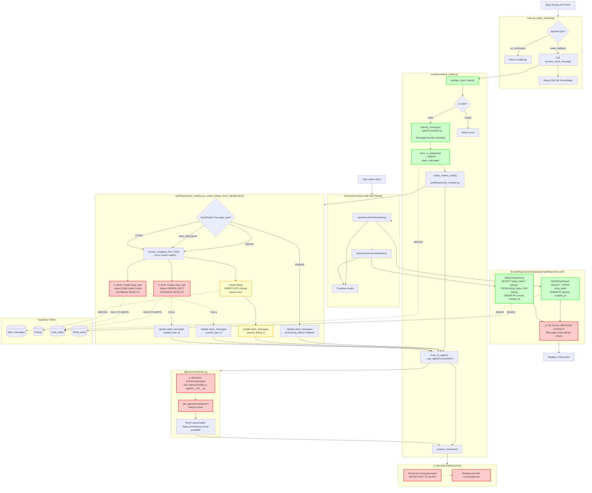

# Slack Message to Inbox Flow - ACTUAL IMPLEMENTATION

## Key Files and Functions

### Backend (Python FastAPI)

**Entry Point:**
- `app/main.py::slack_webhook()` (lines 122-161)
  - Handles URL verification
  - Calls `process_slack_message()`
  - Returns 200 OK immediately

**Workflow Orchestration:**
- `app/workflows/slack_intake.py::build_slack_intake_workflow()`
  - `validate_slack_event()` - Filters bots, checks required fields
  - `classify_message()` - Calls MessageClassifier agent
  - `store_in_database()` - Inserts into slack_messages table
  - `create_entities_node()` - Creates listings/tasks
  - `route_to_agent()` - Attempts orchestrator routing (broken)
  - `prepare_response()` - Generates response string (never sent)

**Classification:**
- `app/agents/classifier.py::MessageClassifier.classify()`
  - Uses OpenAI GPT-4o-mini
  - Returns ClassificationV1 schema
  - Determines message_type: IGNORE, GROUP, STRAY, INFO_REQUEST

**Entity Creation:**
- `app/workflows/entity_creation.py::create_entities_from_classification()`
  - `resolve_assignee_from_hint()` - Fuzzy matches realtor names
  - Creates listings for GROUP messages
  - **BUG:** Creates stray_tasks with invalid status "NEEDS_INFO"
  - **BUG:** References non-existent `notes` column

**Agent Registry:**
- `app/agents/__init__.py::AGENT_REGISTRY`
  - MessageClassifier: ✓ Registered
  - OrchestratorAgent: ✗ Commented out (not registered)

### Frontend (Swift/SwiftUI)

**Inbox Display:**
- `apps/Operations Center/Stores/InboxStore.swift::fetchTasks()`
  - Calls `repository.fetchStrayTasks()`
  - Calls `repository.fetchListingTasks()`
  - Combines and sorts results

**Data Repository:**
- `apps/Operations Center/Shared/Repositories/SupabaseTaskRepository.swift`
  - `fetchStrayTasks()` - Queries stray_tasks table
  - `fetchListingTasks()` - Queries listing_tasks + listings join
  - **MISSING:** No Slack message context included

### Database Schema

**Tables:**
- `slack_messages` - Stores all incoming Slack events with classification
- `listings` - Real estate listings (created from GROUP messages)
- `stray_tasks` - Standalone tasks (created from STRAY/INFO_REQUEST)
- `listing_tasks` - Tasks attached to listings

**Constraints:**
- `stray_tasks.status` CHECK constraint: `('OPEN', 'CLAIMED', 'IN_PROGRESS', 'DONE', 'FAILED', 'CANCELLED')`
  - **PROBLEM:** Code tries to use "NEEDS_INFO" (not allowed)
- `stray_tasks` has NO `notes` column
  - **PROBLEM:** entity_creation.py:208 references it

## Actual Success Rates

- **IGNORE messages:** ✓ 100% success (marked skipped)
- **GROUP messages:** ⚠️ Unknown (depends on listings.status constraint)
- **STRAY messages:** ✗ 0% success (notes column doesn't exist)
- **INFO_REQUEST messages:** ✗ 0% success (invalid status value)

## Critical Bugs

1. **entity_creation.py:196** - `status = "NEEDS_INFO"` violates database constraint
2. **entity_creation.py:208** - References non-existent `stray_tasks.notes` column
3. **agents/__init__.py** - OrchestratorAgent commented out, never executes
4. **main.py** - Response strings generated but never sent to Slack
5. **SupabaseTaskRepository.swift** - No connection to source Slack messages

## What Actually Works

✓ Webhook receives Slack events
✓ Classification via OpenAI
✓ Stores slack_messages records
✓ Frontend displays tasks (if they survive creation)

## What's Broken

✗ Entity creation for STRAY and INFO_REQUEST
✗ Agent orchestration (not registered)
✗ Slack responses (never sent)
✗ Slack message context in frontend

---

**Last Updated:** 2025-01-12
**Status:** PRODUCTION BROKEN - Multiple critical failures
