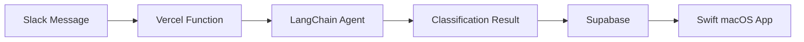

# Documentation

This directory contains all documentation for the Operations Center monorepo.

## Contents

```
docs/
├── README.md                  # This file
├── architecture.md            # System architecture overview
├── deployment.md              # Deployment guides (Vercel, App Store)
├── type-generation.md         # OpenAPI type generation workflow
├── development.md             # Development setup and workflow
├── testing.md                 # Testing strategies and tools
└── contributing.md            # Contribution guidelines
```

## Quick Links

- [Architecture Overview](architecture.md) - System design and components
- [Development Setup](development.md) - Getting started for new developers
- [Deployment Guide](deployment.md) - How to deploy backend and apps
- [Type Generation](type-generation.md) - Keeping types in sync
- [Testing Guide](testing.md) - Test strategies and running tests

## For New Contributors

1. Start with [Development Setup](development.md)
2. Read [Architecture Overview](architecture.md)
3. Review [Contributing Guidelines](contributing.md)
4. See [Type Generation](type-generation.md) when working with APIs

## Documentation Standards

- Use Markdown for all docs
- Include code examples where helpful
- Keep diagrams in Mermaid format (renders in GitHub)
- Update docs when changing architecture or APIs

## Mermaid Diagrams

This repo uses Mermaid for diagrams (renders in GitHub):



## External Resources

- [Migration Guide](../migration/README.md) - From TypeScript to Python
- [LangChain Docs](https://python.langchain.com)
- [Swift Testing Docs](https://developer.apple.com/documentation/testing)
- [SwiftUI Docs](https://developer.apple.com/documentation/swiftui)

## Staying Up to Date

Check the [CHANGELOG.md](../CHANGELOG.md) for recent changes and [ROADMAP.md](../ROADMAP.md) for future plans.
