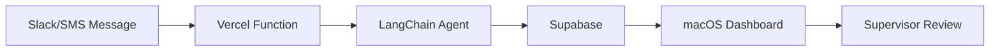

# Operations Center

**A modern monorepo for real-estate operations management with AI-powered message classification.**

---

## 🏗️ Architecture

```
Operations Center
├── Backend (Python + LangChain)
│   └── Message classification, API endpoints
│
├── Frontend (Swift + SwiftUI)
│   └── macOS supervisor dashboard, iOS app (future)
│
└── Shared
    └── OpenAPI specs, types, constants
```

**Flow:**


---

## 📁 Directory Structure

```
operations-center/
├── backend/                   # Python backend services
│   ├── classifier/           # LangChain message classification
│   ├── api/                  # FastAPI or Vercel Functions
│   └── tests/                # Backend tests
│
├── apps/                      # Client applications
│   ├── operations-center-macos/  # Swift + SwiftUI macOS app
│   ├── operations-center-ios/    # iOS app (future)
│   └── shared-ui/                # Shared SwiftUI components
│
├── shared/                    # Shared code and types
│   ├── types/                # OpenAPI spec (source of truth)
│   └── constants/            # Shared constants
│
├── docs/                      # Documentation
│   ├── architecture.md       # System design
│   ├── deployment.md         # Deployment guides
│   └── development.md        # Development setup
│
├── scripts/                   # Build and deployment scripts
│   ├── setup.sh              # Initial setup
│   ├── test-all.sh           # Run all tests
│   └── deploy-backend.sh     # Deploy to Vercel
│
└── migration/                 # Migration docs from TypeScript
    ├── python-langchain-optimal/  # Recommended implementation
    ├── python-slack-migration/    # Simple migration
    └── python-sms-migration/      # Future SMS support
```

---

## 🚀 Quick Start

### Prerequisites

- **Backend:** Python 3.11+, pip or uv
- **Frontend:** Xcode 15+, Swift 6.0, XcodeGen
- **Tools:** Git, GitHub CLI, Vercel CLI

### Setup

```bash
# Clone the repo
git clone https://github.com/ArchieOS/operations-center.git
cd operations-center

# Run setup script (installs all dependencies)
./scripts/setup.sh

# Start backend development server
cd backend
python -m api.dev

# Open macOS app in Xcode
cd apps/operations-center-macos
xcodegen
open OperationsCenter.xcodeproj
```

---

## 🛠️ Development

### Backend (Python)

```bash
cd backend

# Install dependencies
pip install -r requirements.txt

# Run tests
pytest

# Run linter
ruff check .

# Run type checker
mypy .

# Start dev server
python -m api.dev
```

### Frontend (macOS)

```bash
cd apps/operations-center-macos

# Generate Xcode project
xcodegen

# Build and run
xcodebuild -scheme OperationsCenter -configuration Debug

# Run tests
xcodebuild test -scheme OperationsCenter

# Or open in Xcode
open OperationsCenter.xcodeproj
```

### Type Generation

```bash
# Sync types from OpenAPI spec
./scripts/sync-types.sh
```

This generates:
- Python types for backend
- Swift types for frontend
- Ensures type safety across stack

---

## 📦 Tech Stack

### Backend
- **Language:** Python 3.11+
- **Agent Framework:** LangChain (structured output, provider agnostic)
- **LLM:** OpenAI GPT-4o-mini (easily swappable to Anthropic Claude)
- **API:** FastAPI or Vercel Serverless Functions
- **Database:** Supabase (PostgreSQL)
- **Testing:** pytest, ruff, mypy
- **Deployment:** Vercel

### Frontend
- **Language:** Swift 6.0
- **UI:** SwiftUI (macOS 14+, iOS 17+)
- **Networking:** URLSession + swift-openapi-generator
- **Data:** SwiftData
- **Auth:** AppAuth-iOS (OAuth 2.0 + PKCE)
- **Testing:** XCTest, Swift Testing, ViewInspector
- **Deployment:** TestFlight → Mac App Store

### Shared
- **Type System:** OpenAPI 3.1 (single source of truth)
- **Schema Validation:** Pydantic (Python), Codable (Swift)

---

## 🧪 Testing

```bash
# Run all tests (backend + frontend)
./scripts/test-all.sh

# Backend only
cd backend && pytest

# Frontend only
cd apps/operations-center-macos && xcodebuild test -scheme OperationsCenter

# With coverage
cd backend && pytest --cov=. --cov-report=html
```

---

## 🚢 Deployment

### Backend (Vercel)

```bash
# Deploy to production
./scripts/deploy-backend.sh

# Or manually
cd backend
vercel deploy --prod
```

### Frontend (Mac App Store)

```bash
# Build for release
./scripts/deploy-frontend.sh

# Or manually
cd apps/operations-center-macos
xcodebuild archive -scheme OperationsCenter
```

See [docs/deployment.md](docs/deployment.md) for detailed guides.

---

## 📚 Key Features

### Backend
- ✅ **LangChain-powered classification** with automatic Pydantic validation
- ✅ **Provider agnostic** (swap OpenAI ↔ Anthropic in 2 lines)
- ✅ **LangSmith observability** for production debugging
- ✅ **Slack + SMS support** (Slack current, SMS future)
- ✅ **Stateless architecture** (fast, scalable)

### Frontend
- ✅ **Real-time dashboard** for message monitoring
- ✅ **Manual override** for classification results
- ✅ **User management** and role-based access
- ✅ **Analytics and reporting**
- ✅ **Native macOS experience** with SwiftUI

---

## 🗺️ Migration Guide

See [migration/README.md](migration/README.md) for:
- Migrating from TypeScript to Python
- Three implementation options (Simple, Optimal, SMS)
- Comparison matrix and recommendations

**Recommended:** Use `migration/python-langchain-optimal/` for production.

---

## 📖 Documentation

- [Architecture Overview](docs/architecture.md)
- [Development Setup](docs/development.md)
- [Deployment Guide](docs/deployment.md)
- [Type Generation](docs/type-generation.md)
- [Testing Strategies](docs/testing.md)
- [Contributing Guidelines](docs/contributing.md)

---

## 🤝 Contributing

1. Read [Contributing Guidelines](docs/contributing.md)
2. Create a feature branch: `git checkout -b feature/AID-123-my-feature`
3. Make changes following code style
4. Run tests: `./scripts/test-all.sh`
5. Run linters: `./scripts/lint-all.sh`
6. Open a PR with detailed description

---

## 🔒 Security

- Never commit `.env` files or secrets
- Use environment variables for all sensitive data
- Backend: Use Vercel environment variables
- Frontend: Use Keychain for secure storage
- Report security issues to: security@archieos.com

---

## 📜 License

Copyright © 2025 ArchieOS. All rights reserved.

---

## 🙏 Acknowledgments

- **LangChain** for structured output framework
- **OpenAI** for GPT-4o-mini
- **Anthropic** for Claude (optional provider)
- **Vercel** for serverless hosting
- **Supabase** for database
- **Apple** for Swift and SwiftUI

---

## 📞 Support

- **Docs:** [docs/](docs/)
- **Issues:** [GitHub Issues](https://github.com/ArchieOS/operations-center/issues)
- **Email:** support@archieos.com
- **Slack:** #operations-center (internal)

---

## 🚧 Roadmap

- [x] LangChain Python backend
- [x] Slack webhook integration
- [ ] macOS supervisor dashboard
- [ ] SMS webhook integration (Twilio)
- [ ] iOS mobile app
- [ ] Real-time WebSocket updates
- [ ] Advanced analytics
- [ ] Multi-tenant support

See [ROADMAP.md](ROADMAP.md) for detailed timeline.

---

**Built with ❤️ by the ArchieOS team**
