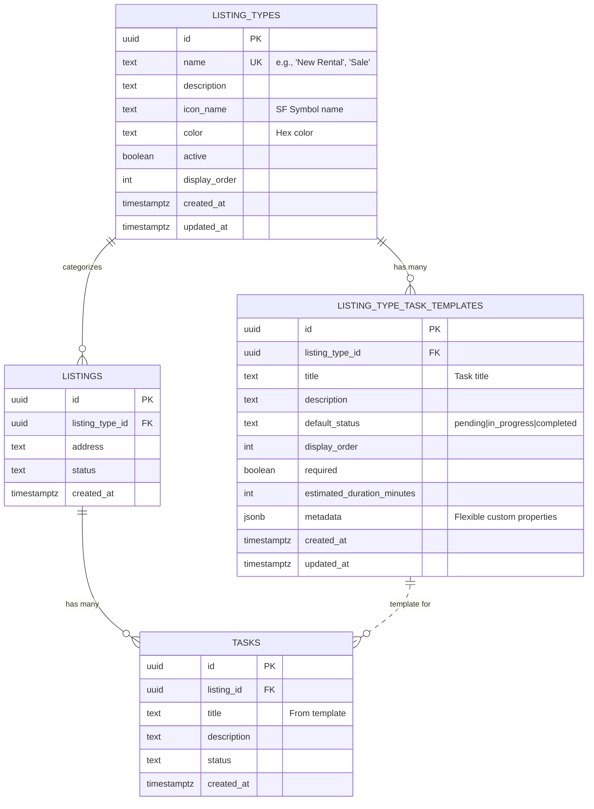
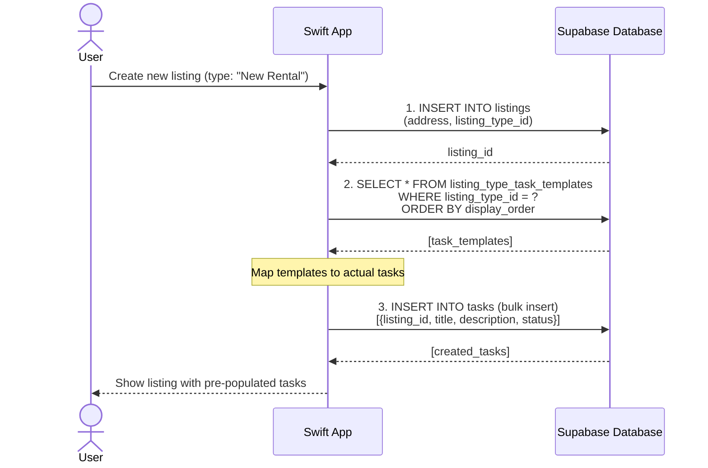
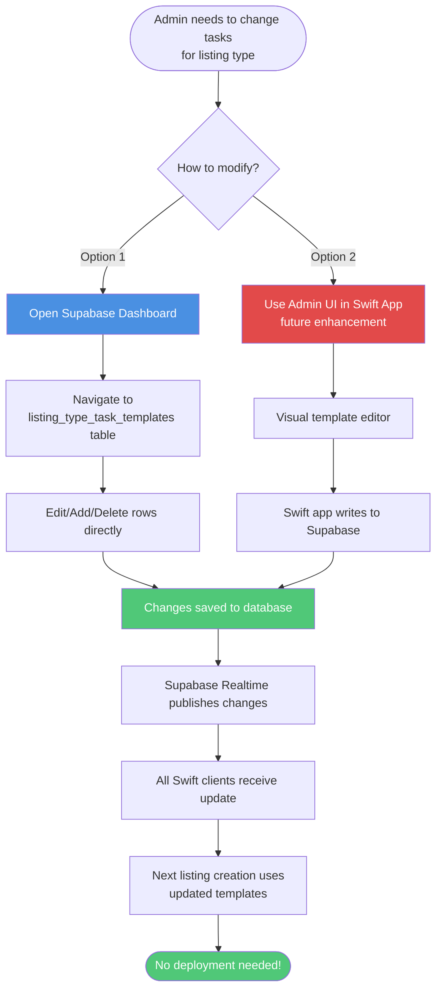
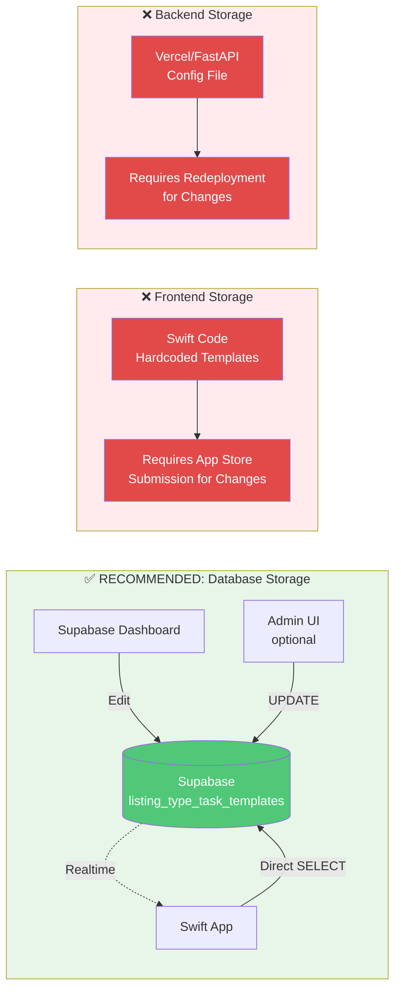
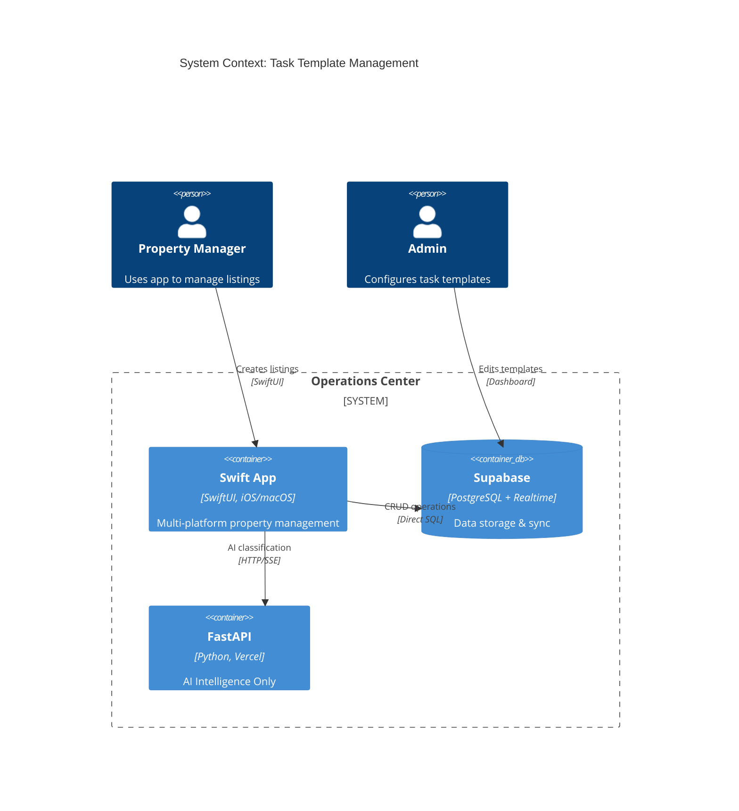

# Task Template Architecture - Mermaid Diagrams

## Database Schema Relationships



## Data Flow: Creating a New Listing with Tasks



## Template Management Flow



## Architecture Comparison



## Example: New Rental Listing Type with Tasks

```mermaid
flowchart TD
    ListingType["Listing Type: 'New Rental'<br/>🏠 #4A90E2"]

    ListingType --> T1[Task 1: Schedule professional photos<br/>⏱️ 30 min | Required ✓]
    ListingType --> T2[Task 2: Set competitive pricing<br/>⏱️ 15 min | Required ✓]
    ListingType --> T3[Task 3: Post to rental platforms<br/>⏱️ 45 min | Required ✓]
    ListingType --> T4[Task 4: Screen applicants<br/>⏱️ 60 min | Optional]
    ListingType --> T5[Task 5: Schedule showings<br/>⏱️ 20 min | Optional]

    T1 --> Instance1["Actual Listing:<br/>123 Main St"]
    T2 --> Instance1
    T3 --> Instance1
    T4 --> Instance1
    T5 --> Instance1

    Instance1 --> ActualTask1[✅ Task: Schedule professional photos<br/>Status: Completed]
    Instance1 --> ActualTask2[⏳ Task: Set competitive pricing<br/>Status: In Progress]
    Instance1 --> ActualTask3[⏹️ Task: Post to rental platforms<br/>Status: Pending]
    Instance1 --> ActualTask4[⏹️ Task: Screen applicants<br/>Status: Pending]
    Instance1 --> ActualTask5[⏹️ Task: Schedule showings<br/>Status: Pending]

    style ListingType fill:#4A90E2,color:#fff
    style Instance1 fill:#9C27B0,color:#fff
    style ActualTask1 fill:#50C878,color:#fff
    style ActualTask2 fill:#FFA500,color:#fff
```

## System Architecture Overview



